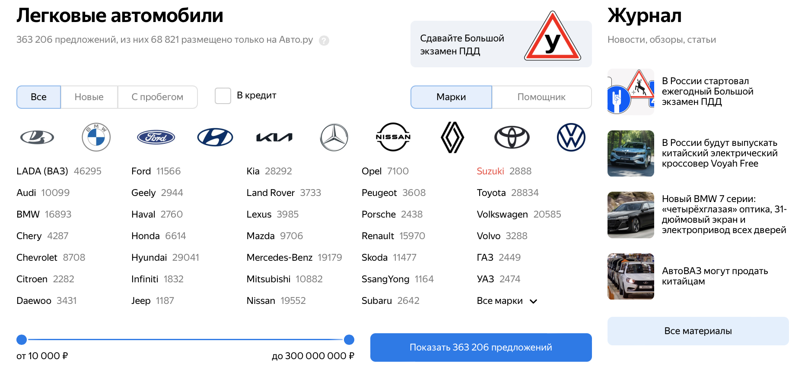

# Задача предсказания цены автомобилей на сайте auto.ru

## Описание
Для получения данных использвуется ноутбук parse.ipynb, которые парсит данные по указанным моделям автомобилей.
Далее в файле eda.ipynb проведен разведочный анализ данных.
В файле model.ipynb произведена работа с признаками и построение, оценка моделей.

## Библиотеки
selenium, pandas, sklearn, xgboost, matplotlib, seaborn, 
